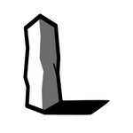

# Lithic UK
## Unitary Knowledge 

**A Portability-First Outliner Knowledgebase**

  

[**Try it here: lithic.uk**](https://lithic.uk)

Lithic is a bespoke Personal Knowledge Management System (PKMS) built on the powerful **TiddlyWiki** engine, re-engineered for a modern academic and engineering workflow. It bridges the gap between the database flexibility of TiddlyWiki and the rapid, outlining experience of **Logseq**.

### The Core Philosophy

* **Logseq-Inspired, Markdown Native:**
    Lithic abandons traditional wikitext in favor of standard **Markdown**. This ensures a frictionless writing experience familiar to Logseq users, keeping your data portable and compatible with industry-standard editors.

* **Smart Inferences:**
  * **Frictionless Time Tracking:** Log your work via interstitial journaling and let Lithic implicitly calculate the time spent. (Includes manual overrides for when you inevitably walk away from your keyboard and forget to log off).
  * **Contextual Implicit Tagging:** Lithic understands your outline's hierarchy. When a parent node references a specific note or context, its nested children automatically inherit that relationship without tedious, redundant tagging.
  * **Declarative Scheduling:** Manage your time purely by dropping journal date references onto to-do items. The integrated calendar also doubles as a date-picker, allowing you to right-click any date to copy the exact pointer needed to link tasks to your timeline.

* **Sane, Print-Ready PDFs:**
    Web-based knowledge bases often fail when physical media is required. Lithic prioritizes "paper-first" CSS, ensuring that your digital notes convert into clean, professional, and sane PDFs for homework submissions, lab reports, and archiving.

* **True Portability:**
    A single-file application that works **100% offline**. It lives on your local machine or thumb drive—no cloud dependency required.

---
*An extension of [TiddlyStudy](https://github.com/postkevone/tiddlystudy) based on [TiddlyWiki](https://tiddlywiki.com/).*

# Self-Hosting/Remote Syncing

Self hosting instructions can be found in [self-host.md](https://github.com/Xyvir/Lithic/blob/main/self-host.md)

# Roadmap
1. Version 1 Released: 
- Lithic is packaged as a plugin
- Standardized Manual Build steps

Version 1.5 release: 
- includes overtype editor with syntax highlighting.
- Better mobile formatting.

Version 1.95 released:
- MAJOR Perfomance upgrade (default Tiddlystudy Backlink Pills were poorly optimized by using Regex)
- 'Anchors' plugin for stream templates.
- Calendar view & todo integration
- Bulkops Sidebar w/ savable filters (and a few smart defaults).
- "Time Spent" indicator.
- A few other cross-plugin teaks and improvments. 

Version 1.98 released:
- I stopped doing changelogs and official versioning around here. Bunch of stuff added.

TODO:

MODULARIZE LAUNCHER.HTML MONOLITH

- need to break it up into invidiual files to keep development sane; and then roll it up with CI/CD using either:
Vite + vite-plugin-singlefile OR esbuild
and minify

SELF-HOST IMPROVEMENTS:

**Public Sharing**
- Create mechanism for self-hosters to specify 'public' *.liths. (hook into existing external *.lith payload url injection?)
- Change self-hoster entrypoint to /login? (so public is default?)
  

MISC
- "Full-screen" long-from editor when clicking on bullet points.
- Simple UI Mode toggle. (Hide a lot of Tiddlywiki-specific UI, on by default.)
- Fully Expanded Slashcommands
- Replace overtype with omni-editor
- Rust Backend for Launcher apps
- Multiplatform Launcher apps
- native e2ec p2p syncing via Iroh Docs?
- Create a vs-code extension? or extend an existing extension for viewing, editing, and folding *.lith files.
With per-section syntax highlighting, section folding, etc.

  
